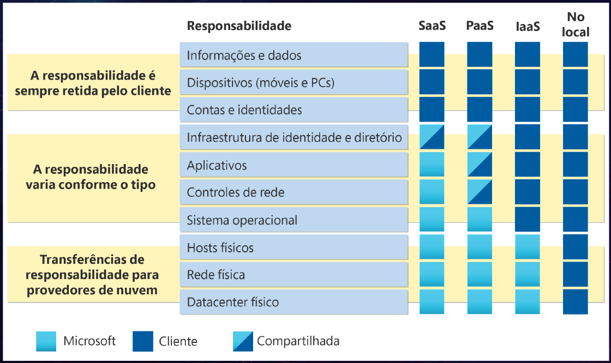
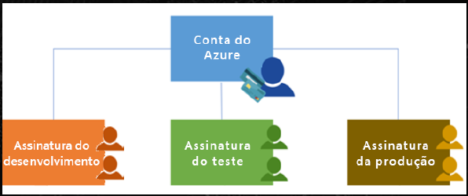
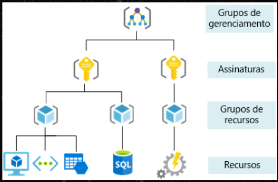
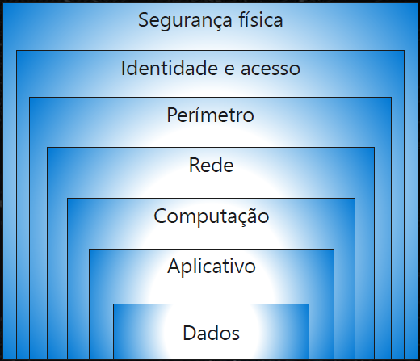
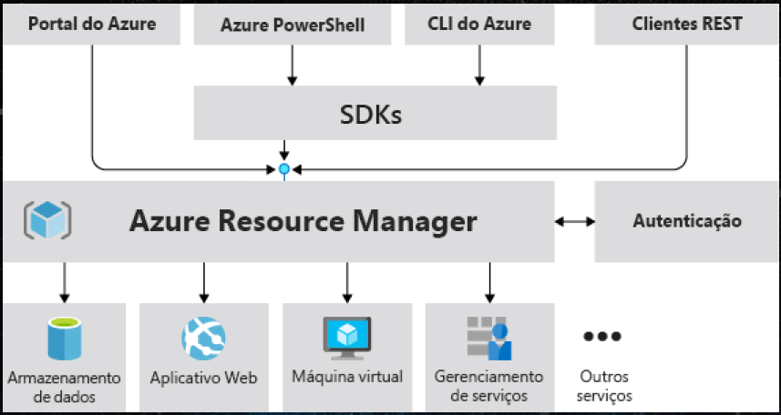

# Exame AZ-900

Anotações de Estudo para Exame AZ-900 - Fundamentos do Microsoft Azure

Veja as referências para o exame [AZ-900: Microsoft Azure Fundamentals](https://docs.microsoft.com/pt-br/learn/certifications/exams/az-900).

## Computação em Nuvem

Computação em nuvem é a entrega de serviços de computação por meio da Internet, possibilitando uma inovação mais rápida, recursos flexíveis e economia de escala.

## Modelos de Computação em Nuvem

### Nuvem Privada

- As organizações criam um ambiente em nuvem em seu datacenter
- A organização é responsável por operar os serviços que fornece
- Não fornece acesso aos usuários fora da organização
- O hardware deve ser comprado para inicialização e manutenção
- As organizações têm controle total sobre os recursos e a segurança
- As organizações são responsáveis pela manutenção e pelas atualizações de hardware

### Nuvem Pública

- Pertencente a serviços de nuvem ou provedor de hosting
- Fornece recursos e serviços a várias organizações e usuários
- Acessada via conexão de rede segura (geralmente pela Internet)
- Nenhuma despesa de capital para escalar verticalmente
- Os aplicativos podem ser provisionados e desprovisionados rapidamente
- As organizações pagam apenas pelo que utilizam

### Nuvem Híbrida

Combina as nuvens pública e privada para permitir que os aplicativos sejam executados no local mais apropriado.

- Fornece a maior flexibilidade
- As organizações determinam onde executar seus aplicativos
- As organizações controlam a segurança, a conformidade e os requisitos legais

## CapEx e OpEx

### Despesas de Capital (CapEx)

- O gasto inicial de dinheiro na infraestrutura física
- Os custos de CapEx têm um valor que é reduzido ao longo do tempo

### Despesas Operacionais (OpEX)

- Gastos em produtos e serviços conforme necessário, pagamento conforme o uso
- Receber a conta imediatamente

## Modelo baseado em consumo

Os provedores de serviço de nuvem operam em um modelo baseado em consumo, o que significa que os usuários finais só pagam pelos recursos que usam. O pagamento é feito pelo que quer que tenha sido usado.

- Melhor previsão de custos
- São fornecidos os preços para serviços e recursos individuais
- A cobrança é baseada no uso real

## Benefícios do uso de Serviços de Nuvem

### Alta disponibilidade (High Availability)

- disponibilidade = tempo de atividade
- garantir que os recursos estejam disponíveis quando necessário
- alta disponibilidade se concentra em garantir a disponibilidade máxima

### Escalabilidade (Scalability)

- escala = capacidade de lidar com a demanda
- escalabilidade refere-se à capacidade de ajustar recursos para atender à demanda
- benefício da escalabilidade é que você não está pagando além do necessário pelos serviços
- dois tipos de escalabilidade:
  - Vertical: aumentar ou diminuir a capacidade dos recursos
  - Horizontal: adição ou subtração do número de recursos

### Confiabilidade (Reliability)

- capacidade que um sistema tem de se recuperar de falhas e continuar funcionando
- um dos pilares do WAF (Microsoft Azure Well-Architected Framework)
- o Azure aproveita a escala global para oferecer confiabilidade

### Previsibilidade (Predictability)

- pode se concentrar na previsibilidade de desempenho ou na previsibilidade de custo
  - Desempenho: prever os recursos necessários para oferecer uma experiência positiva aos clientes
  - Custo: prever o custo dos gastos com a nuvem (TCO, Calculadora de Preços, Monitoramento)
- soluções com custo e desempenho previsíveis

### Governança e Conformidade (Governance and Compliance)

### Segurança (Security)

### Capacidade de gerenciamento (Manageability - Gerenciabilidade)

- Gerenciamento da nuvem: diz respeito a gerenciar seus recursos de nuvem
- Gerenciamento na nuvem: diz respeito à maneira de gerenciar seu ambiente de nuvem e seus recursos
  - Portal; CLI, APIs

## Tipos de Serviços de Nuvem

### IaaS (infraestrutura como serviço)

- basicamente o hardware é alugado em um datacenter de nuvem, mas cabe a você decidir o que fazer com ele
- oferece o máximo de controle sobre os recursos de nuvem
- Cenários:
  - Migração lift-and-shift
  - Teste e desenvolvimento: replicar esses ambientes rapidamente

### PaaS (Plataforma como serviço)

Adequado para fornecer um ambiente de desenvolvimento completo sem a preocupação de manter toda a infraestrutura de desenvolvimento.

- Cenários:
  - Estrutura/Plataforma de desenvolvimento
  - Análise ou business intelligence

### SaaS (software como serviço)

Você está essencialmente alugando ou usando um aplicativo totalmente desenvolvido

- coloca a maior responsabilidade sobre o provedor de nuvem e a menor responsabilidade com o usuário
- Cenários:
  - E-mail, mensagens, calendários
  - Aplicativos de produtividade empresarial (Office 365)
  - Controle de finanças e despesas

## Modelo de responsabilidade compartilhada

## Infraestrutura Física - Organização Física do Azure

### Regiões (Regions)

É uma área geográfica do planeta que contém pelo menos um ou vários datacenters.

### Zonas de Disponibilidade (AZs - Availability Zones)

Datacenters separados fisicamente dentro de uma região.

### Datacenters

Instalações físicas com todos os equipamentos computacionais e infraestrutura do Azure.

### Pares de Regiões (Region Pairs)

A maioria das regiões do Azure é emparelhada a outra região na mesma geografia (como EUA, Europa ou Ásia) a pelo menos 300 milhas (cerca de 480 km) de distância entre elas.

### Regiões Soberanas (Sovereign Regions)

Instâncias do Azure isoladas da instância principal do Azure

- US Gov – Virgínia, US Gov Iowa
- Leste da China, Norte da China (parceria com a 21Vianet)

## Infraestrutura de Gerenciamento - Estrutura Organizacional do Azure

### Recursos (Resources)

Bloco de construção básico do Azure. Os recursos do Azure são componentes como armazenamento, máquinas virtuais e redes que estão disponíveis para criar soluções de nuvem.

### Grupos de Recursos (Resource Groups)

Agrupamentos lógicos de recursos

- pode conter vários recursos
- um recurso pode estar em apenas um grupo de recursos por vez
- alguns recursos podem ser movidos entre grupos de recursos
- grupos de recursos não podem ser aninhados (apenas um nível)

### Contas / Assinaturas (Subscriptions)

As assinaturas são uma unidade de gerenciamento, cobrança e escala.

- a Conta é uma identidade no Azure AD ou um diretório no qual o Azure AD confia
- uma Conta do Azure pode conter várias assinaturas vinculadas a ela
- assinaturas permitem organizar logicamente seus grupos de recursos e facilitar a cobrança
    (relatórios de cobrança e faturas separados para cada assinatura, para organizar e gerenciar os custos)
- assinatura fornece acesso autenticado e autorizado a serviços e produtos do Azure

### Grupos de Gerenciamento (Management Groups)

Fornecem um nível de escopo acima das assinaturas.

- organiza as assinaturas em contêineres (grupos de gerenciamento) e aplica condições de governança neles
- Grupos de gerenciamento podem ser aninhados (até 6 níveis abaixo do root)

## Serviços de Computação

### Máquinas Virtuais (VMs - Virtual Machines)

- Oferta IaaS
- Controle total sobre o SO (sistema operacional).
- Capacidade para executar um software personalizado.
- Usar configurações personalizadas de hospedagem.
- Precisa configurar, atualizar e manter o software executados.

### Conjuntos de Escala de VMs (Scale Sets)

- Permitem criar e gerenciar um grupo de VMs idênticas e com balanceamento de carga
- Escalonamento automática em resposta à demanda ou com base em uma agenda definida
- Implantam automaticamente um balanceador de carga para uso eficiente dos recursos

### Conjuntos de Disponibilidade da VM (Availability Sets)

- Ajuda a criar um ambiente mais resiliente e altamente disponível
- Domínio de atualização (Update domain): apenas um agrupamento de domínio de atualização estará offline por vez
    (proteção contra tempo de inatividade por atualização)
- Domínio de falha (Fault domain): agrupa as VMs por origem de energia e comutador de rede (até 3 domínios)
    (proteção contra falha de rack - energia/rede)
- Não há nenhum custo adicional para configurar um Conjunto de Disponibilidade

### Casos de uso de VMs

- Durante o teste e o desenvolvimento de aplicações
- Ao executar aplicativos na nuvem
- Ao estender e/ou migrar (lift-and-shift) seu datacenter para a nuvem
- Disaster Recovery (recuperação de desastre)

### Área de Trabalho Virtual do Azure

- serviço de virtualização de área de trabalho e aplicativos na nuvem
- funciona com aplicativos para acessar áreas de trabalho remotas ou a maioria dos navegadores
- permite que você use a multissessão do Windows 10 ou Windows 11 Enterprise

### Azure containers

- Contêineres são um ambiente de virtualização
- os contêineres são uma ótima opção executar várias instâncias de um aplicativo em um só computador host
- geralmente usados para criar soluções que utilizam uma arquitetura de microsserviço
- Ofertas PaaS

- Instâncias de Contêiner (Azure Container Instances)
  - maneira mais rápida e simples de executar um contêiner no Azure
- Aplicativos de Contêiner (Azure Container Apps)
  - semelhantes, em muitos aspectos, a uma instância de contêiner
  - benefícios extras: capacidade de incorporar balanceamento de carga e colocação em escala
- Serviço de Kubernetes (Azure Kubernetes Service)
  - serviço de orquestração de contêiner

### Funções do Azure (Azure Functions)

- É uma opção de computação sem servidor (serverless) controlada por eventos que não requer a manutenção de máquinas virtuais ou contêineres
- Não há necessidade de manter os recursos provisionados quando não há eventos que executem a função
- Você só é cobrado pelo tempo de CPU usado durante a execução da função

### Serviço de aplicativo (Azure Application Service)

- Oferece dimensionamento automático e alta disponibilidade
- Compatível com o Windows e o Linux
- Permite integrar com GitHub, Azure DevOps ou qualquer repositório Git para implantação contínua
- Baseado em HTTP para hospedagem de aplicativos Web, APIs REST e back-ends móveis
- Suporte a várias linguagens: .NET, .NET Core, Java, Ruby, Node.js, PHP ou Python

## Serviços de Rede

### Redes Virtuais (VNet) e as Sub-redes

- Isolamento e segmentação
- Comunicação pela Internet
  - IP público
  - Balanceador de Carga público
- Comunicação entre recursos do Azure
  - VNets
  - Pontos de extremidade de serviço (Service endpoints)
- Comunicação com os recursos locais
  - VPN Gateway Point-to-site e Site-to-site
  - Azure ExpressRoute (com o Azure e 365)
- Rotear tráfego de rede
  - Roteamento de tráfego padrão do Azure entre sub-redes, redes locais e na internet
  - Tabelas de rotas (Rote tables)
  - BGP (Border Gateway Protocol)
- Filtrar tráfego de rede
  - Grupos de Segurança de Rede (Network Security Groups): IP de origem e destino, porta e protocolo
  - Soluções de virtualização de rede (Network virtual appliances)
- Conectar redes virtuais
  - Emparelhamento de redes (Vnet Peering)
  - UDR (User-defined routes)

### Pontos de extremidade públicos (Public endpoints)

- têm um endereço IP público e podem ser acessados de qualquer lugar do mundo

### Pontos de extremidade privados (Private endpoints)

- existem em uma VNet e têm um endereço IP privado dentro do espaço de endereço dessa VNet

### ExpressRoute

- conectar redes locais com a nuvem da Microsoft em uma conexão privada
- rede any-to-any (VPN de IP), uma rede Ethernet ponto a ponto ou uma conexão cruzada virtual por meio de um provedor de conectividade
- as conexões do ExpressRoute não passam pela Internet pública
- mais confiabilidade, mais velocidade, latências consistentes e muito mais segurança
- Alcance Global do ExpressRoute: conectividade global com os serviços da Microsoft em todas as regiões entre sites locais conectando seus circuitos do ExpressRoute
- Roteamento dinâmico com BGP

### DNS do Azure

- Serviço de hospedagem para domínios DNS que fornece a resolução de nomes usando a infraestrutura do Azure
- Pode gerenciar os registros DNS para serviços do Azure e também fornece o DNS para recursos externos
- Benefícios:
  - Confiabilidade e desempenho
  - Segurança
  - Facilidade de uso
  - Personalizar redes virtuais: suporte a domínios DNS privados
  - Registros de alias
  
  Você não pode usar o DNS do Azure para comprar um nome de domínio; depois de comprados, seus domínios podem ser hospedados no DNS do Azure para gerenciamento de registros.

## Serviços do Armazenamento do Azure

### Contas de Armazenamento (Storage Accounts)

- Namespace exclusivo acessados de qualquer lugar do mundo por HTTP ou HTTPS
    (nome de conta exclusivo no Azure)
- Dados seguros, altamente disponíveis, duráveis e maciçamente escalonáveis
- Opções de redundância de armazenamento:
  - (LRS) Armazenamento com redundância local
  - (GRS) Armazenamento com redundância geográfica
  - (RA-GRS) Armazenamento com redundância geográfica com acesso de leitura
  - (ZRS) Armazenamento com redundância de zona
  - (GZRS) Armazenamento com redundância de zona geográfica
  - (RA-GZRS) armazenamento com redundância de zona geográfica com acesso de leitura

Os dados são sempre replicados três vezes na região primária de maneira síncrona (local ou por zona).
Você pode selecionar a região primária para a conta; a região secundária emparelhada é baseada nos Pares de Região do Azure e não pode ser alterada.
Os dados são replicados na região secundária de maneira assíncrona - normalmente com RPO inferior a 15 minutos

- Tipos:
  - Uso geral v2 Standard
  - Blobs de blocos Premium
  - Compartilhamentos de arquivos Premium
  - Blobs de página Premium
- Serviço de armazenamento:
  - Blobs do Azure: um repositório de objetos para texto e dados binários (Big Data por meio do Data Lake Storage Gen2)
  - Arquivos do Azure: compartilhamentos de arquivos para implantações locais e em nuvem (SMB-Win;Lin;Mac ou NFS-Lin;Mac)
  - Filas do Azure: armazenamento de mensagens para mensageria entre componentes do aplicativo
  - Azure Disks: volumes de armazenamento em nível de bloco para VMs do Azure
  - Tabelas do Azure: opção de tabela NoSQL para dados estruturados não relacionais
- Ponto de extremidade do serviço:
  - Armazenamento de Blobs: `https://<storage-account-name>.blob.core.windows.net`
  - Data Lake Storage Gen2: `https://<storage-account-name>.dfs.core.windows.net`
  - Arquivos do Azure: `https://<storage-account-name>.file.core.windows.net`
  - Armazenamento de Filas: `https://<storage-account-name>.queue.core.windows.net`
  - Armazenamento de Tabelas: `https://<storage-account-name>.table.core.windows.net`
- Camadas de Acesso de Blobs:
  - Hot: dados que são acessados com frequência
  - Cool: dados acessados com menos frequência e armazenados por ao menos 30 dias
  - Cold: dados acessados com pouca frequência e armazenados por ao menos 90 dias
  - Archive: dados acessados raramente e armazenados por ao menos 180 dias

### Migrações para Azure (Azure Migrate)

- migrar de um ambiente local para a nuvem
- Plataforma de migração unificada
- Avaliação e migração
- Variedade de ferramentas:
  - Descoberta de avaliação;
  - Migração de Servidor;
  - Assistente de Migração de Dados
  - Migração de Banco de Dados do Azure
  - Assistente de Migração do Serviço de Aplicativo do Azure

### Azure Data Box

- serviço de migração física (usando um dispositivo de armazenamento enviado pela Microsoft) que ajuda a transferir grandes quantidades de dados de maneira rápida, barata e confiável
- capacidade máxima de armazenamento utilizável de 80 terabytes
- o dispositivo pode ser solicitado pelo portal do Azure para transferir dados de ou para o Azure
- ideal para transferir os tamanhos de dados maiores do que 40 TB em cenários com conectividade de rede limitada a inexistente

### Movimentação de arquivos do Azure

- AzCopy
  - utilitário de linha de comando para copiar arquivos de/para uma conta de armazenamento.
  - permite sincronização de arquivos de apenas uma direção
- Azure Storage Explorer (Gerenciador de Armazenamento do Azure)
  - aplicativo que fornece interface gráfica para gerenciar arquivos e blobs em sua Conta do Armazenamento do Azure
  - funciona em Windows, macOS e Linux e usa o AzCopy no back-end
- Azure File Sync (Sincronização de Arquivos do Azure)
  - permite centralizar seus compartilhamentos de arquivos no serviço Arquivos do Azure e manter a flexibilidade, o desempenho e a compatibilidade de um servidor de arquivos do Windows

## Identidade, Acesso e Segurança do Azure

### Azure AD (Azure Active Directory)

Serviço de diretório que permite que você entre e acesse aplicativos de nuvem da Microsoft e aplicativos de nuvem que você desenvolve.

- É o serviço de gerenciamento de acesso e identidade baseado em nuvem da Microsoft

### Quem usa o Azure AD

- Administradores de TI
- Desenvolvedores de aplicativos
- Usuários
- Assinantes do serviço online

### O que o Azure AD faz

- Autenticação: redefinição de senha por autoatendimento, autenticação multifator, uma lista personalizada de senhas banidas e serviços de bloqueio inteligente.
- Logon único (SSO)
- Gerenciamento de aplicativo
- Gerenciamento de dispositivo: o Azure AD dá suporte ao registro de dispositivos
  - dispositivos gerenciados com a ferramenta Microsoft Intune
  - permite que políticas de Acesso Condicional baseadas no dispositivo

### Azure AD Connect

- Um método de conexão do Azure AD com o AD local
- Sincroniza identidades de usuário entre o Active Directory local e o Azure AD
- Permite SSO, autenticação multifator e redefinição de senha por autoatendimento em ambos

### Azure AD DS (Azure Active Directory Domain Services)

- serviço que fornece serviços de domínio gerenciado, como ingresso no domínio, política de grupo, protocolo LDAP e autenticação Kerberos/NTLM
- permite usar serviços de diretório sem precisar manter uma infraestrutura de suporte
- O Azure AD DS integra-se com o seu locatário existente do Azure AD
- Permite executar aplicativos herdados na nuvem que não podem usar métodos de autenticação modernos, realizando lift-and-shift desses aplicativos do ambiente local para um domínio gerenciado

### Autenticação

- Processo de estabelecer a identidade de uma pessoa, um serviço ou um dispositivo
- Métodos: senhas padrão, SSO (logon único), MFA (autenticação multifator) e métodos sem senha
- MFA - dois ou mais elementos para autenticaçaõ, sendo 3 categorias:
  - Algo que o usuário saiba– essa pode ser uma pergunta de desafio.
  - Algo que o usuário tenha – pode ser um código enviado para o celular.
  - Algo que o usuário seja – impressão digital ou reconhecimento facial.
- Autenticação sem senha que se integram ao Azure AD:
  - Windows Hello para Empresas
  - Aplicativo Microsoft Authenticator
  - Chaves de segurança FIDO2

### Autorização

- Determina o nível de acesso de uma pessoa ou serviço autenticado
- Define quais dados eles podem acessar e o que podem fazer com eles

### Identidades externas do Azure

Uma identidade externa é uma pessoa, um dispositivo, um serviço etc. que está fora da sua organização.

- Colaboração B2B (Business to business): são representados em seu diretório, normalmente como usuários convidados.
- B2B Direct Connect: relação de confiança mútua de duas vias com outra organização do Azure AD para colaboração contínua (uso do Teams)
- Azure AD B2C (business to customer): Publique aplicativos SaaS modernos ou personalizados (exceto aplicativos Microsoft) para consumidores e clientes

### Acesso Condicional do Azure

- ferramenta do Azure AD para permitir (ou negar) o acesso a recursos com base em sinais de identidade:
  - quem é o usuário
  - onde ele está
  - de qual dispositivo está solicitando acesso

### RBAC do Azure (controle de acesso baseado em função do Azure)

- Funções internas que descrevem regras de acesso comuns para os recursos de nuvem
- Você também pode definir suas funções
- Cada função tem um conjunto associado de permissões de acesso relacionadas a essa função
- Atribua indivíduos ou grupos a uma ou mais funções para receberem todas as permissões de acesso relacionadas
- O RABC é aplicado a um escopo (hierárquico):
  - Um grupo de gerenciamento (uma coleção de várias assinaturas)
  - Uma assinatura única
  - Um grupo de recursos
  - Um recurso individual

### Modelo de Confiança Zero (Zero Trust)

É um modelo de segurança que pressupõe o pior cenário e protege os recursos com essa expectativa. Se baseia nos princípios:

- Verificar de modo explícito
- Usar o acesso com o mínimo de privilégios: JIT/JEA (Just-In-Time e Just-Enough-Access)
- Pressupor a violação

### Defesa em Profundidade (Defense-in-Depth)

- Conjunto de camadas, com os dados a serem protegidos no centro e todas as outras camadas funcionando para proteger essa camada de dados central
- Essa abordagem elimina a dependência de qualquer camada única de proteção
- Desacelera um ataque e fornece informações de alerta sobre as quais as equipes de segurança podem agir, automática ou manualmente
- Camadas da defesa em profundidade:
  - Segurança física
  - Identidade e Acesso
  - Perímetro
  - Rede
  - Computação
  - Aplicativo
  - Dados

### Microsoft Defender para Nuvem

- Ferramenta de monitoramento para gerenciamento da postura de segurança e proteção contra ameaças: ambientes de nuvem, locais, híbridos e de várias nuvens
- Fornece diretrizes e notificações com o objetivo de fortalecer sua postura de segurança
- A implantação do Defender para Nuvem é fácil e já está integrada nativamente ao Azure, muitos serviços do Azure são monitorados e protegidos sem a necessidade de qualquer implantação:
  - Serviços PaaS do Azure
  - Serviços de dados do Azure
  - Redes
- Em ambientes híbridos e de várias nuvens, os planos do Microsoft Defender são estendidos para computadores que não são Azure com a ajuda do Azure Arc
  - Para computadores locais, implante o Azure Arc e habilite os recursos de segurança aprimorados do Defender para Nuvem
  - Os recursos do CSPM do Defender para Nuvem se estendem aos seus recursos da AWS, sem agentes
- O Defender para Nuvem preenche três necessidades vitais:
  - Avaliar continuamente: conheça sua postura de segurança. Identifique e rastreie vulnerabilidades
  - Proteger: Proteja recursos e serviços com o Azure Security Benchmark
  - Defender: Detecte e resolva ameaças a recursos, cargas de trabalho e serviços

## Gerenciamento de Custos no Azure

### Calculadora de Preço

- Projetada para fornecer um custo estimado para provisionar recursos no Azure
- O foco da calculadora de preços está no custo dos recursos provisionados no Azure

### Calculadora de TCO (Custo Total de Propriedade)

- Projetada para ajudá-lo a comparar os custos para executar uma infraestrutura local versus uma infraestrutura de nuvem do Azure
- Você insere sua configuração, adiciona suposições como custos com energia e mão de obra de TI e recebe uma estimativa da diferença de custo para executar o mesmo ambiente no datacenter atual ou no Azure

### Gerenciamento de Custos (Cost Management)

- Permite verificar rapidamente os custos de recursos do Azure, criar alertas com base nos gastos com recursos e criar orçamentos que podem ser usados para automatizar o gerenciamento de recursos

## Governança e Conformidade no Azure

### Microsoft Purview

- soluções de governança, risco e conformidade de dados
- reúne insights sobre dados locais, multinuvem e SaaS
- Duas áreas de solução principais: risco e conformidade e governança unificada de dados
  - Descoberta de dados automatizada
  - Classificação de dados confidenciais
  - Linhagem de dados de ponta a ponta

### Azure Policy

- permite criar, atribuir e gerenciar políticas que controlam ou auditam os recursos
- políticas impõem regras diferentes sobre as configurações dos recursos, de modo que essas configurações permaneçam em conformidade com os padrões corporativos
- avalia seus recursos e realça os que não estão em conformidade com as políticas criadas
- também pode impedir a criação de recursos sem conformidade

### Resource Locks (Bloqueio de Recursos)

- impede que os recursos sejam excluídos ou alterados acidentalmente
- podem ser aplicados a recursos individuais, grupos de recursos ou até mesmo a toda uma assinatura
- Dois tipos de Locks:
  - Delete: não poderão excluir
  - ReadOnly: não poderão excluir ou atualizar o recurso
- Os bloqueios de recursos se aplicam independentemente das permissões de RBAC

### Portal de Confiança do Serviço (Service Trust Portal)

- oferece acesso a vários conteúdos, ferramentas e outros recursos sobre práticas de segurança, privacidade e conformidade da Microsoft

## Gerenciar e Implantar Recursos do Azure

### Ferramentas para Gerenciar o Azure

- Portal do Azure
- Azure Cloud Shell: ferramenta de shell baseada em navegador com suporte ao Azure PowerShell e à CLI (bash)
- Azure PowerShell
- CLI (Interface de Linha de Comando) do Azure

### Azure Arc

- permite estender a conformidade e o monitoramento do Azure para suas configurações híbridas e multinuvem
- simplifica a governança e o gerenciamento ao fornecer uma plataforma centralizada e unificada de gerenciamento local e de várias nuvens
- o Azure Arc permite que você gerencie os seguintes tipos de recursos hospedados fora do Azure:
  - Servidores
  - Clusters do Kubernetes
  - Serviços de Dados do Azure
  - SQL Server
  - Máquinas virtuais (versão prévia)

### Azure Resource Manager (ARM)

- O ARM é o serviço de implantação e gerenciamento do Azure que permite criar, atualizar e excluir recursos em sua conta do Azure
- Gerenciar a infraestrutura por meio de modelos declarativos em vez de scripts. Um modelo do ARM é um arquivo JSON que define o que será implantado no Azure

### Modelos do ARM (IaC)

Descrever os recursos que deseja usar em um formato JSON declarativo - definir o estado desejado e a configuração de cada recurso no modelo do ARM. Benefícios:

- Sintaxe declarativa
- Resultados repetidos
- Orquestração
- Arquivos modulares
- Extensibilidade com scripts de implantação (configuração do ambiente)

## Ferramentas de Monitoramento no Azure

### Azure Advisor (Assistente do Azure)

- Avalia os recursos do Azure e faz recomendações para ajudar a melhorar a confiabilidade, a segurança e o desempenho, alcançar a excelência operacional e reduzir os custos
- Ajudar você a poupar tempo na otimização da nuvem
- As recomendações incluem ações sugeridas que você pode adotar imediatamente, adiar ou ignorar
- É possível configurar notificações de alerta sobre novas recomendações
- Cinco categorias de recomendações:
  - Confiabilidade
  - Segurança
  - Desempenho
  - Excelência Operacional
  - Custo

### Azure Service Health (Integridade do Serviço do Azure)

- Conhecer o status da infraestrutura global do Azure e de cada um de seus recursos, por meio dos serviços:
  - O Status do Azure: integridade dos serviços do Azure em todo o globo
  - A Integridade do Serviço: se concentra nos serviços e regiões do Azure que você está usando
  - O Resource Health: fornece informações sobre a integridade de cada um de seus recursos de nuvem

### Azure Monitor

- plataforma para coletar dados sobre seus recursos, analisar esses dados, visualizar as informações e até mesmo agir com base nos resultados
- pode monitorar recursos do Azure, seus recursos locais e até mesmo recursos de várias nuvens

- Azure Log Analytics: é a ferramenta do portal do Azure em que você escreverá e executará consultas de log nos dados coletados pelo Azure Monitor

- Azure Monitor Alerts: são formas automatizadas de se manter informado caso o Azure Monitor detecte um limite sendo ultrapassado. Os Alertas do Azure Monitor também podem tentar uma ação corretiva.

- Application Insights: monitora seus aplicativos Web; consegue monitorar aplicativos que esteja em execução no Azure, localmente ou em outro ambiente de nuvem. Duas maneiras de configurar o Application Insights para ajudar a monitorar seu aplicativo: instalar um SDK em seu aplicativo ou usar o agente do Application Insights. O agente do Application Insights é compatível com C#.NET, VB.NET, Java, JavaScript, Node.js e Python.

##

Bons estudos!!!

**André Carlucci**
